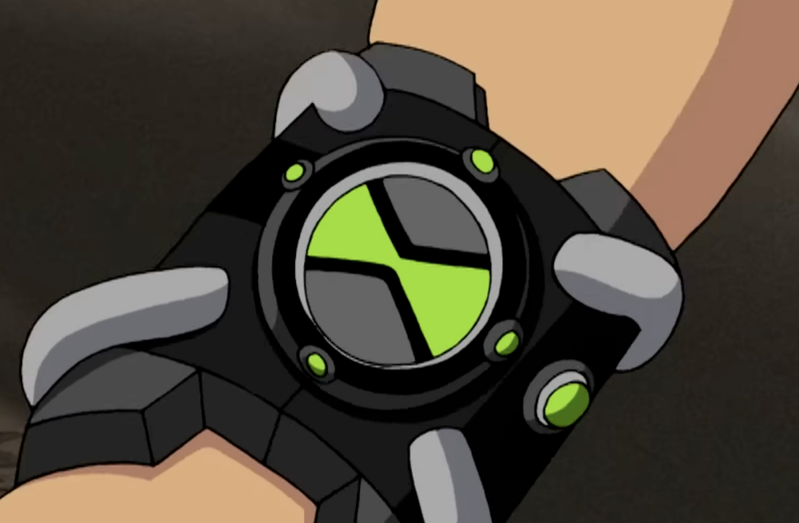
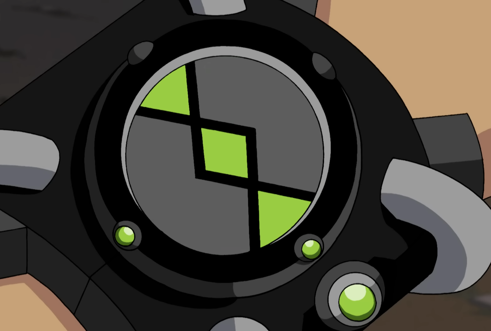
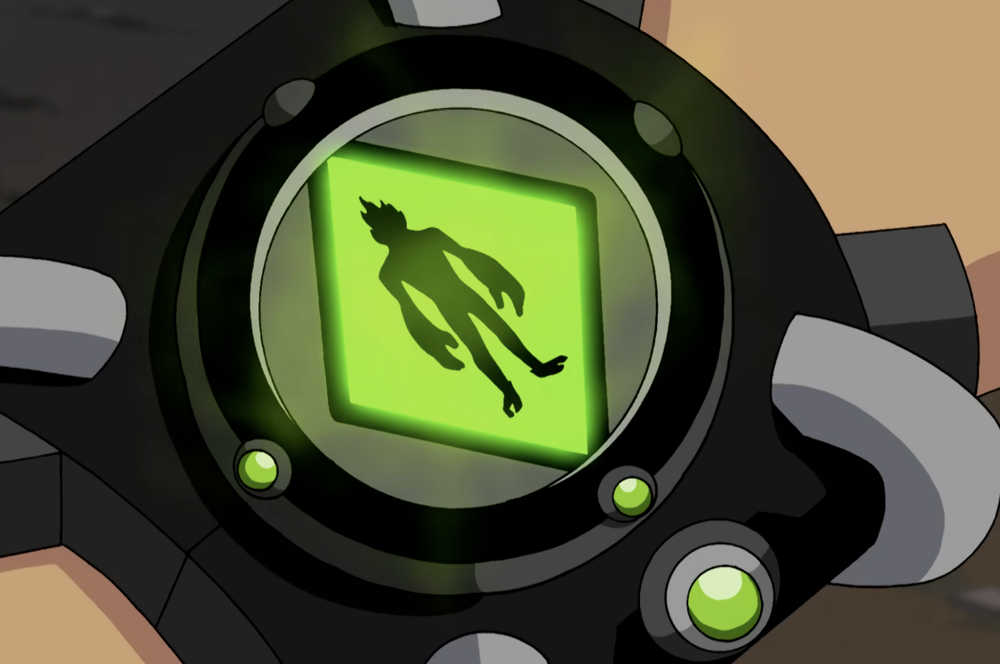

# Omnitrix Watch App Design

## Default State

The screen has a central green hourglass symbol divided into two symmetrical halves by a black X-shaped pattern. The inner background is a bright neon green, forming the main glow of the interface.

## Transition to Active State

The borders of the hourglass symbol go inwards to reveal the alien image. Center always remains green and other parts of the screen are gray. Border is black.

## Active Alien Selection State

The screen shows a green diamond shape with a black alien image in the center. There is a black border around the diamond shape. Other parts of the screen are gray.

## Styling

### Colors

- Primary Background Color: Green
- Time out Background Color: Red
- Border Color: Black
- Outside Border Color: Gray
